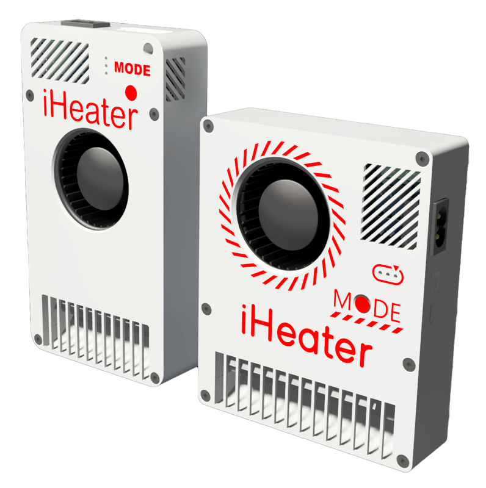
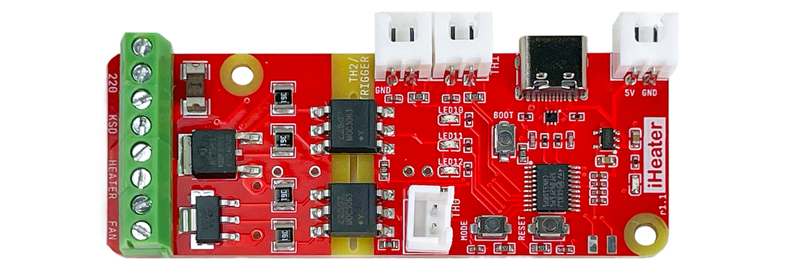

[](https://docs.idryer.org/iHeater/)
[](https://t.me/iDryer)
[](https://discord.gg/jGce5eeHHz)

# About the iHeater Project

iHeater is a compact and powerful solution for creating an active thermal chamber in any 3D printer. It is especially essential for printers with closed or proprietary electronics, such as those from Creality, Bambu Lab, and FlashForge, where available ports or options for connecting heaters, fans, and thermistors are often limited.

iHeater connects via USB and takes over control independently of the mainboard's limitations. Depending on the firmware used, it can operate autonomously or with full integration into Klipper.

When used in combination with bed heating, iHeater ensures uniform chamber heating-a crucial factor for printing materials like ABS, PA, PC, and other engineering plastics. The device dynamically manages heating based on the air temperature, creating stable conditions inside the chamber without overheating or temperature spikes.

Two versions are currently available:

* 100W for smaller printers (archived)
* 200W for larger printers



**Under Klipper Control**

The board works as a separate MCU in Klipper, fully autonomously controlling the chamber heater and fan. Thanks to its 220 V power supply, iHeater does not load the printer’s power supply, which is especially important since stock PSUs often operate at their limit.

The cost of the board is comparable to or even lower than building a similar solution from a regular microcontroller, solid-state relay, and other components. Nevertheless, enthusiasts still have the option to build their own version.

iHeater is a simple way to add chamber heating to your printer to improve print quality and expand the range of materials used.



**With iHeater Firmware**

[](https://github.com/pavluchenkor/iHeater-Standalone-Firmware)

The iHeater board is self-sufficient and includes all the necessary peripherals and interface for use as a standalone device. The desired temperature is set by sequentially pressing the MODE button, and the selected temperature is encoded and displayed using three LEDs. The increment can be changed in the firmware.

<!-- 
# iHeater Configuration for Klipper

This repository contains configuration files for the iHeater 3D printer chamber heater based on Klipper firmware and the control board of the same name. The configuration is designed to control the chamber heater and fans using the iHeater microcontroller.


## Table of Contents

- [Requirements](#requirements)
- [Preparation](#preparation)
- [Flashing Firmware to iHeater](#flashing-firmware-to-iheater)
- [Klipper Configuration](#klipper-configuration)
  - [Connecting the `iHeater` MCU](#1-connecting-the-iheater-mcu)
- [Usage](#usage)
  - [Chamber Heating Commands](#chamber-heating-commands)
  - [Automation and Control Logic](#automation-and-control-logic)
- [Notes](#notes)
- [License](#license)

## Requirements

- **Hardware:**
  - iHeater control board
  - NTC 100K 3950 thermistors (2 pcs.)
  - PTC heating element 220V 100W for the chamber
  - 7530 fan 220V for chamber air circulation
  - Thermal fuse KSD9700 or similar (220V 5A 130°C)

- **Software:**
  - Klipper (latest version)
  - A configured and running Klipper host

## Preparation

1. **Assemble the hardware:**
   - Connect the heating element and fans to the iHeater.
   - Connect the KSD to the appropriate socket.
   - Install the thermistors in the chamber and connect them to the appropriate MCU pins.
   - Make sure the pins are connected correctly according to the config file.

2. **Install the required files:**
   - Copy the `iHeater.cfg` file to the Klipper configuration directory.

## Flashing Firmware to iHeater

1. **Build the Klipper firmware for stm32f042:**

```bash
cd klipper/
make menuconfig
```

2. **In the menu, select:**

- Enable extra low-level configuration options  
- Micro-controller Architecture: STMicroelectronics STM32  
- Processor model: STM32F042  
- Bootloader offset: 8KiB bootloader  
- Clock Reference: Internal clock  
- Communication interface: USB (on PA9/PA10)

3. **Disable unnecessary options:**

```text
[*] Support GPIO "bit-banging" devices  
[ ] Support LCD devices  
[ ] Support thermocouple MAX sensors  
[ ] Support adxl accelerometers  
[ ] Support lis2dw and lis3dh 3-axis accelerometers  
[ ] Support MPU accelerometers  
[ ] Support HX711 and HX717 ADC chips  
[ ] Support ADS 1220 ADC chip  
[ ] Support ldc1612 eddy current sensor  
[ ] Support angle sensors  
[*] Support software based I2C "bit-banging"  
[ ] Support software based SPI "bit-banging"
```

4. Save and exit the menu.

5. Compile the firmware:

```bash
make clean
make
```

Expected output:

```
Creating hex file out/klipper.bin
```

6. Flash the firmware to the iHeater board:

If needed, install python3-serial:

```bash
sudo apt install python3-serial
```

**The following assumes the Katapult bootloader is installed.**

- Connect iHeater to the host in programming mode (hold the Mode button while connecting or double-press RESET).
- Find the device:

```bash
ls /dev/serial/by-id/
```

Expected result:

```
usb-katapult_stm32f042x6_0C0018000D53304347373020-if00
```

- Replace with your device ID and run:

```bash
python3 ~/katapult/scripts/flashtool.py -d /dev/serial/by-id/usb-katapult_stm32f042x6_... -f ~/klipper/out/klipper.bin
```

Expected result:

```
Flash Success
```

- Verify:

```bash
ls /dev/serial/by-id/
```

Expected:

```
usb-Klipper_stm32f042x6_...-if00
```

```text
iHeater is ready to work with Klipper
```

## Pin Configuration

| Pin  | Alias | Function                          |
|------|-------|-----------------------------------|
| PA0  | TH1   | Chamber temperature sensor        |
| PA1  | HEATER| Heater control                    |
| PA2  | FAN   | Fan control                       |
| PA3  | TH0   | Heater temperature sensor         |
| PA4  | MODE  | Mode button                       |
| PA5  | LED3  | LED 3                             |
| PA6  | LED2  | LED 2                             |
| PA7  | LED1  | LED 1                             |

## Klipper Configuration

Copy the iHeater.cfg file to the folder containing printer.cfg and include it using the `[include]` directive:

```ini
[include iHeater.cfg]
```

### 1. Connecting the iHeater MCU

Edit the `iHeater.cfg` file and specify the obtained serial ID:

```ini
[mcu iHeater]
serial: usb-Klipper_stm32f042x6_0C0018000D53304347373020-if000
```

## Usage

### Chamber Heating Commands

- Set chamber temperature:

```gcode
M141 S60 ; Set chamber temp to 60°C
```

- Wait for chamber to reach temperature:

```gcode
M191 S60 ; Wait until chamber reaches 60°C
```

- Stop chamber heating:

```gcode
M141 S0  ; Disable chamber heating
```

- At the end of your slicer’s G-code, add `M141 S0` to properly shut down chamber heating.

## Notes

- **Safety:**
  - Make sure all connections are correct and safe.
  - Check that min_temp and max_temp match your hardware specs.

- **Hardware check:**
  - Test heater and fan operation before use.
  - Monitor temperature during first runs.

- **PID tuning:**
  - Perform PID tuning if precise temperature control is needed. -->

## License

This project is licensed under the MIT License. See the [LICENSE](./license.en.md) file for details.


>⚠️ **Warning: The use of heating elements and temperature control involves fire and equipment damage risk. Always follow manufacturer recommendations and observe safety precautions.
