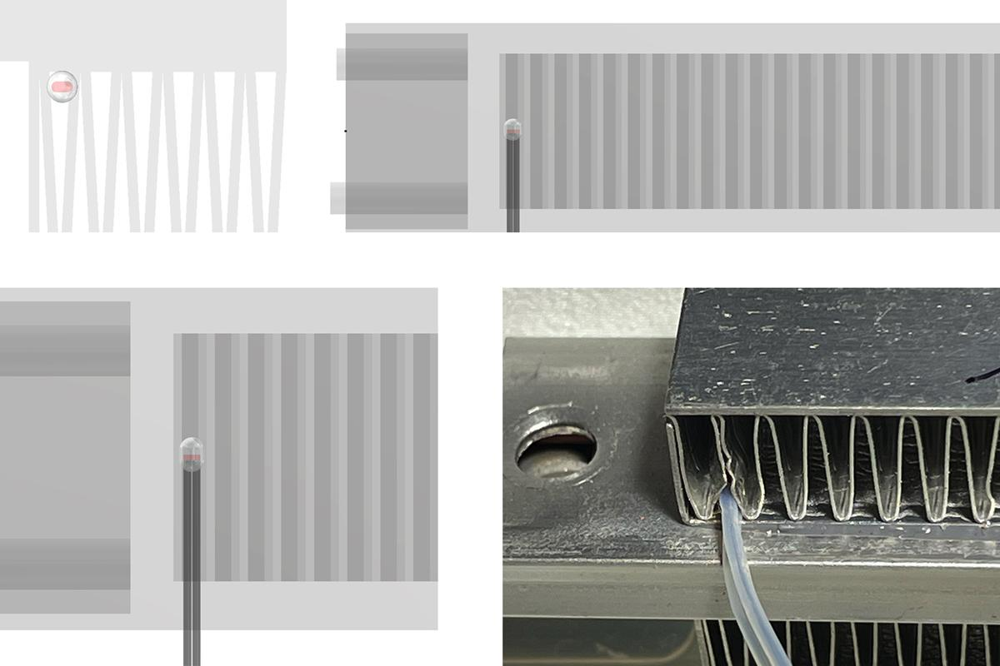

## Сборка

# Перед сборкой¶

## Документация
Ознакомьтесь с документацией, скачайте и распечатайте необходимые детали. Удостоверьтесь в наличии необходимых деталей и инструментов.

## Приступая к сборке

Рекомендуется сначала собрать всю систему **на столе**, без монтажа в корпус, и провести тестирование:

- Подключить **все** компоненты.
- Проверить работоспособность нагревателя, вентилятора, датчиков температуры.
- Подключить систему к **Klipper** или прошить standalone прошивкой и убедиться в корректной работе макросов.

Video guide: [YouTube](https://youtu.be/1QMtVY0Vx-8?si=Ol1u4Ux9wALDcfe2)

### Установка платы

### Установка Термистора и KSD

!!! warning "Установка термистора"
    Убедитесь, что провода термистора не соприкасаются с металлическим корпусом нагревателя. Если есть сомнения, термистор следует заизолировать - например, обмотать каптоновым скотчем или поместить в любой термостойкий изолирующий материал (например, тефлоновую трубку или термоусадочную изоляцию).

    Помните, температура нагревателя может достигать 140С

!!! warning "Установка термопредохранителя"
    Вы можете установить либо самовосстанавливающийся термовыключатель, такой как KSD9700, либо плавкий термопредохранитель.

    Имейте в виду, что плавкий предохранитель — это одноразовое защитное устройство: при превышении температуры он навсегда разрывает цепь, и для восстановления потребуется его замена на аналогичный.

    В свою очередь, KSD9700 представляет собой биметаллический термовыключатель. Он размыкает цепь при достижении заданной температуры и автоматически замыкает её обратно, когда температура опускается ниже установленного порога. Это позволяет системе восстановить работу без замены компонента.

    С точки зрения безопасности, плавкий предохранитель обеспечивает более надёжную защиту, поскольку исключает повторное включение в случае неисправности или перегрева.

    Поскольку это DIY-проект, и работа с нагревательными элементами требует понимания принципов электрической безопасности, если вы не уверены в своих действиях, рекомендуется сначала настроить систему с использованием KSD9700 (для тестирования и отладки), а затем заменить его на соответствующий плавкий предохранитель.

### Установка нагревателя

### Проводка

### Установка НШВИ

### Коммутация

### Финальная сборка

### Готовое изделие

