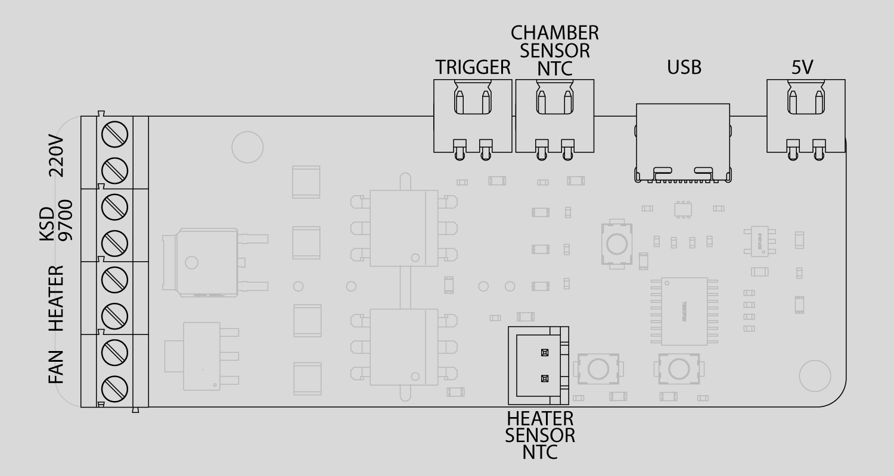
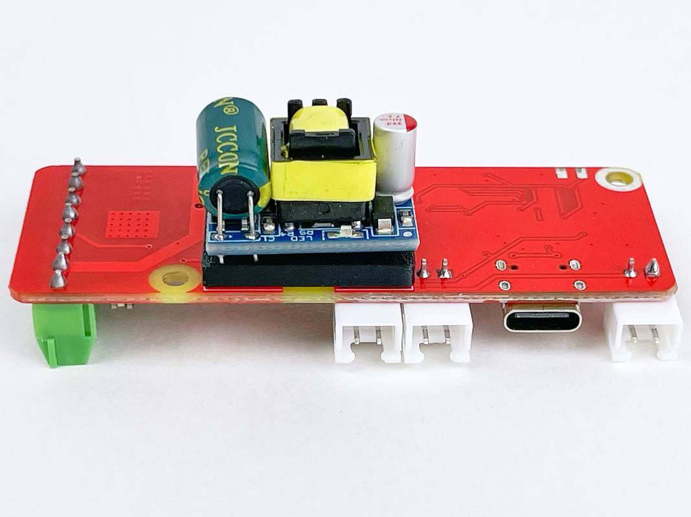
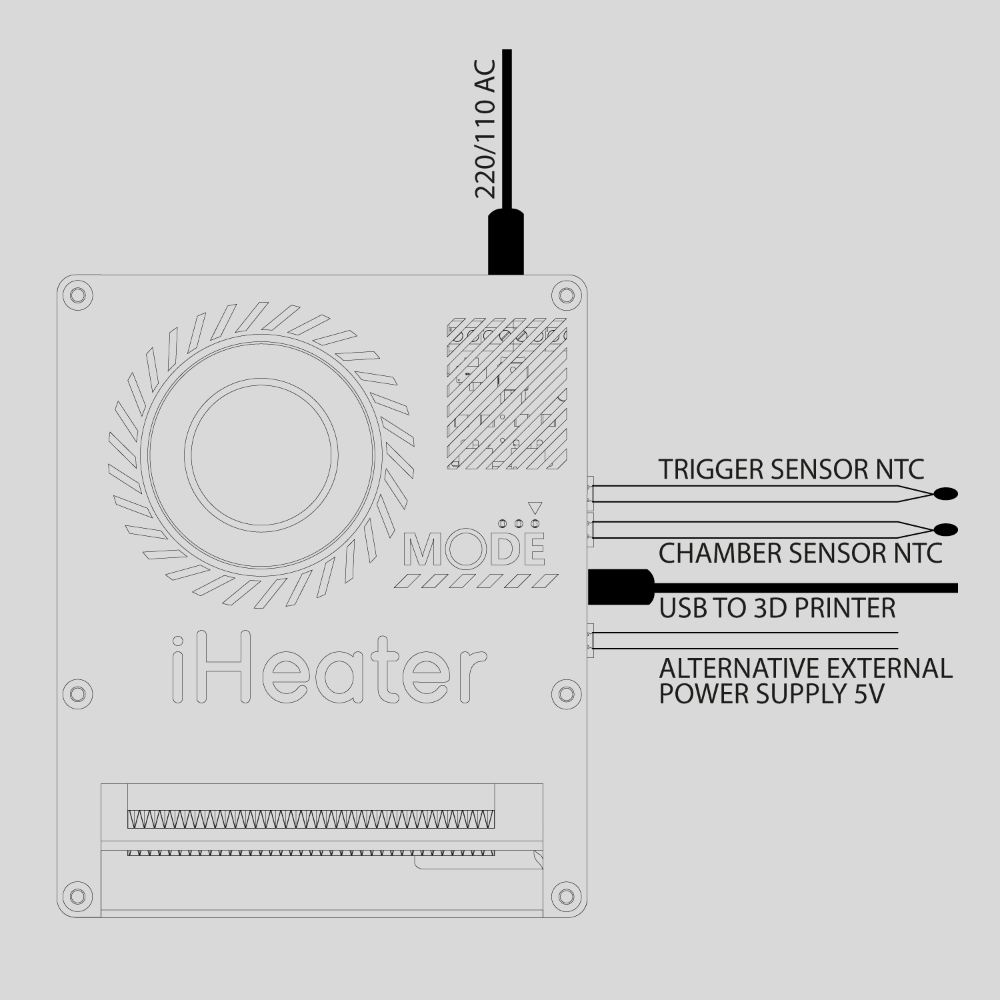

## Схема подключения

Контроллер **iHeater** может работать как в составе системы **Klipper** (в качестве дополнительного MCU), так и автономно — под управлением встроенной прошивки **standalone**.

### Подключение для работы с Klipper

Для корректной работы в составе Klipper необходимо подключить:

* **USB-кабель** к основному хосту (Host-MCU) - по нему осуществляется передача данных и питание 5В;
* **Силовое питание 220В / 110В** - в зависимости от версии устройства и типа нагревателя;
* **Термистор нагревателя** - для контроля температуры нагревательного элемента;
* **Термистор камеры** - для контроля температуры воздуха в камере принтера;
* **Порт триггера** - опциональное подключение, используется для автоматического управления от внешнего сигнала.

В рабочем состоянии iHeater размещается внутри камеры 3D-принтера.

!!! note annotate "Рекомендуется размещать термистор камеры на уровне печатающей головки, по возможности - **над столом**."

## Конфигурация GPIO

| Pin    | Alias       | Function                          |
|--------|-------------|-----------------------------------|
| PA0    | TH1         | Температурный датчик камеры       |
| PA1    | HEATER      | Управление нагревателем           |
| PA2    | FAN         | Управление вентилятором           |
| PA3    | TH0         | Температурный датчик нагревателя  |
| PA4    | MODE        | Кнопка режима                     |
| PA5    | LED3        | Светодиод 3                       |
| PA6    | LED2        | Светодиод 2                       |
| PA7    | LED1        | Светодиод 1                       |
| PB1    | TH2         | Дополнительный температурный датчик|

---

### Использование в режиме standalone

В автономном режиме доступны дополнительные функции и способы подключения:

* **Порт триггера в режиме термистора**
  При подключении термистора к порту триггера и размещении его рядом с нагревательным элементам стола можно включить автоматическое управление:
  - при нагреве стола выше **45°C** - включается нагрев камеры;
  - при снижении температуры ниже **85°C** - нагрев отключается.

* **Питание от внешнего источника 5В**
  При невозможности использования USB-питания можно подать питание напрямую через соответствующий разъём.

* **Экспериментальная опция**
  Подключение [источника питания 5В напрямую на плату](https://sl.aliexpress.ru/p?key=OHtN3Xm).

---

### Общая схема подключения

