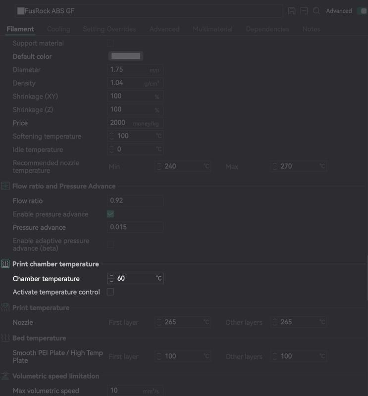

## Настройка стартового G-code в слайсере для корректной работы iHeater

Для достижения равномерного прогрева и стабильной печати с техническими материалами важно правильно настроить порядок команд в стартовом G-code. Ниже приведены рекомендации по интеграции нагрева камеры iHeater в стартовый код вашего слайсера (например, Cura, PrusaSlicer, OrcaSlicer и т.д.).

### Что нужно сделать

Перед включением нагрева камеры необходимо:

**Включить нагрев стола**

   Прогрев стола помогает камере прогреваться равномернее и быстрее Такой стол выступает как дополнительный источник тепла, который способствует более эффективному прогреву всей камеры.

   ```
   M140 S[first_layer_bed_temperature]
   ```

**Включить вентилятор перемешивания воздуха (если используется)**

   Это может быть боковой вентилятор или любой другой, предназначенный для равномерного распределения тепла в камере.
   Если в конфигурации Klipper он называется, например, `chamber_fan`, то:

   ```
   SET_FAN_SPEED FAN=chamber_fan SPEED=1.0
   ```

В некоторых принтерах установлены вытяжные вентиляторы поддерживающие минимально возможную температур в камере, это важно при печати такими пластиками как PLA и PETG, но вредит скорости нагрева камеры. Такому вентилятору можно передать новый параметр температуры, например целевая_температура_в_камере + 10

```
SET_TEMPERATURE_FAN_TARGET TEMPERATURE_FAN=chamber_fan TARGET={chamber_temperature + 10}
```

**Включить нагрев камеры с помощью одного из макросов: `M141` или `M191`**

### Разница между `M141` и `M191`

| Макрос | Назначение                                                                     | Блокирует ли выполнение кода                                      |
| ------ | ------------------------------------------------------------------------------ | ----------------------------------------------------------------- |
| `M141` | Устанавливает целевую температуру камеры                                       | Нет (нагрев начинается, но печать продолжается сразу)             |
| `M191` | Устанавливает температуру камеры и ждет, пока она достигнет заданного значения | Да (переход к следующей команде произойдёт только после прогрева) |

#### Примеры:

* Если вы хотите немедленно начать прогрев камеры и выполнять все предварительные операции параллельно нагреву, а затем продолжить печать, не дожидаясь полного прогрева камеры, подойдет такой вариант. Это хорошо работает для пластиков типа ABS и крупных моделей - пока печатаются первые несколько слоев, камера успеет прогреться:

  ```
  M141 S60
  ```

* Если печатается маленькая деталь или требуется стабильная температура камеры (например, при печати PA, PC и других чувствительных материалов), лучше использовать команду с ожиданием прогрева:

  ```
  M191 S60
  ```

### После нагрева камеры

После вызова одного из макросов (`M141` или `M191`) можно продолжать обычный стартовый G-code:

```gcode
M190 S[first_layer_bed_temperature]  Ожидание нагрева стола
M109 S[first_layer_temperature]  Ожидание нагрева хотэнда
G28  Хоуминг
G29  (если используется автокалибровка)
... 
```

### Рекомендации

* Если вы используете `M191`, можно задать небольшое отклонение, при котором камера считается достаточно прогретой (например, 5°C ниже цели) - это настраивается в макросе [gcode_macro CHAMBER_VARS] `variable_start_offset`.
* Убедитесь, что все используемые макросы (`M141`, `M191`) подключены в конфигурации Klipper и настроены корректно.
* Если ваш слайсер поддерживает условия, можно добавить проверку: например, включать камеру только при температуре печати выше 50°C (для ABS, ASA и т.д.).

---

### Настройка температуры в термокамере в слайсере



Во многих современных слайсерах можно указать желаемую температуру термокамеры прямо в профиле филамента. Это значение удобно использовать как параметр `S` для макросов `M141` или `M191`.

На скриншоте показано поле "Chamber temperature", в котором задано значение `60°C`. Это лишь числовое значение - **не все слайсеры не отправляет команду на нагрев камеры**. Чтобы температура действительно применялась, необходимо проверить формирование G-code слайсером использовать команды в стартовом G-code в случае необходимости:

```gcode
M141 S{chamber_temperature}
```

или

```gcode
M191 S{chamber_temperature}
```

Также убедитесь, что переменная `chamber_temperature` задана в настройках слайсера, или замените её числом вручную.

Если активировать опцию "Activate temperature control", некоторые слайсеры автоматически добавляют команду `M191` с заданным значением температуры. Это удобно, если вы хотите, чтобы прогрев камеры происходил с ожиданием перед печатью.

Рекомендуется использовать ручное управление через макросы, чтобы иметь полный контроль над логикой прогрева и последовательностью действий.
